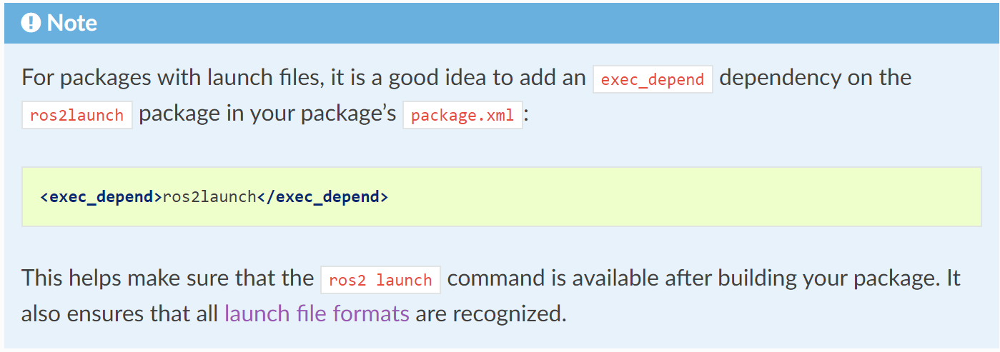

# ROS2常用代码段(一)

[TOC]

## ament_cmake编写

### 创建功能包

```shell
ros2 pkg create pkg_name --build-type ament_cmake
```

> 此处可以不写`--build-type`,指令默认创建的便是`ament_camke`

### 一般的编写方法

#### 库编写

##### 添加库

```cmake
# 添加源文件，生成库
add_library(my_math_lib SHARED
        include/my_math_lib/my_math_lib.hpp
        src/my_math_lib.cpp
        )
# 添加头文件地址
target_include_directories(my_math_lib PUBLIC
        $<BUILD_INTERFACE:${CMAKE_CURRENT_SOURCE_DIR}/include>
        $<INSTALL_INTERFACE:include>
        )
```

##### 链接依赖

```cmake
# 用于代替传统的target_link_libraries
ament_target_dependencies(my_math_lib
        PUBLIC
        rclcpp
        )
```

##### 导出依赖

```cmake
# 为了使下游文件可以访问
ament_export_targets(my_math_lib HAS_LIBRARY_TARGET)
ament_export_dependencies(
        rclcpp
)

# 注册 导出头文件
install(
        DIRECTORY include/
        DESTINATION include
)

# 注册 导出库文件
install(
        TARGETS my_math_lib # 告诉ros2有这么个目标（可执行文件或者库）
        EXPORT my_math_lib
        ARCHIVE DESTINATION lib
        LIBRARY DESTINATION lib
        RUNTIME DESTINATION bin
        INCLUDES DESTINATION include
)
ament_package()
```

##### package.xml

```xml
<package format="2">
    <version>0.0.0</version>
    <name>my_math_lib</name>
    <description>my_math_lib</description>
    <maintainer email="renyunfan@outlook.com">Yunfan Ren</maintainer>
    <license>BSD</license>
    <buildtool_depend>ament_cmake</buildtool_depend>
    <export>
        <build_type>ament_cmake</build_type>
    </export>
</package
```

#### 使用自定义的库

##### 查找库

```cmake
find_package(my_math_lib REQUIRED)
```

##### 生成可执行文件

```cmake
# 查找依赖文件
add_executable(complex_test
        src/complex_test.cpp
        )
```

##### 链接库

```cmake
ament_target_dependencies(complex_test
        my_math_lib
        rclcpp
        )
```

##### 安装可执行文件

```cmake
install(TARGETS complex_test
        DESTINATION lib/${PROJECT_NAME})
```

##### package.xml

```xml
<package format="2">
    <version>0.0.0</version>
    <name>my_math_lib</name>
    <description>my_math_lib</description>
    <maintainer email="renyunfan@outlook.com">Yunfan Ren</maintainer>
    <license>BSD</license>
    <buildtool_depend>ament_cmake</buildtool_depend>
    <depend>my_math_lib</depend>
    <export>
        <build_type>ament_cmake</build_type>
    </export>
</package>
```

### 使用ament_cmake_auto简化

#### 库编写

```cmake
cmake_minimum_required (VERSION 3.5)
project(test)

find_package (ament_cmake_auto REQUIRED) 
ament_auto_find_build_dependencies ()

ament_auto_add_library ( my_lib SHARED 
    src/example.cpp 
    include/example.hpp)

ament_auto_package ()
```

#### ament_cmake_auto的一些宏接口

##### **[ament_auto_add_executable](https://link.zhihu.com/?target=https%3A//github.com/ament/ament_cmake/blob/master/ament_cmake_auto/cmake/ament_auto_add_executable.cmake)**

```cmake
# 相当于
add_executable()
target_include_directories()
target_link_libraries()
```

##### **[ament_auto_add_library](https://link.zhihu.com/?target=https%3A//github.com/ament/ament_cmake/blob/master/ament_cmake_auto/cmake/ament_auto_add_library.cmake)**
```cmake
# 相当于
add_library()
target_include_directories()
target_link_libraries()
```

##### [ament_auto_find_build_dependencies](https://link.zhihu.com/?target=https%3A//github.com/ament/ament_cmake/blob/master/ament_cmake_auto/cmake/ament_auto_find_build_dependencies.cmake)

> 他会自动将xml中填写了的依赖给连接上，相当于不用写find_package了。

##### [ament_auto_package](https://link.zhihu.com/?target=https%3A//github.com/ament/ament_cmake/blob/master/ament_cmake_auto/cmake/ament_auto_package.cmake)

> 这个用来代替以前的export和两次install，以及最后的ament_package。

##### **[ament_auto_generate_code](https://link.zhihu.com/?target=https%3A//github.com/ament/ament_cmake/blob/master/ament_cmake_auto/cmake/ament_auto_generate_code.cmake)**

> 看起来是个很诱人的宏，感觉像是生成cfg和msg、srv之类的，不过点进去看源码，**应该是还没实现**。

### 使用ament_cmake_python集成cpp和python

#### 配置package.xml

> - 增加`<buildtool_depend>ament_cmake_python</buildtool_depend>`行和`rclpy`，支持python使用。
> - 注意：在标准的 Python 包中，你应该有 ament_python，而不是 ament_cmake_python。 确保不要混合使用这 2 个。
> - 使用 ament_cmake_python 意味着我们将能够使用 cmake 设置我们的 Python 内容。

```xml
<?xml version="1.0"?>
<?xml-model href="http://download.ros.org/schema/package_format3.xsd" schematypens="http://www.w3.org/2001/XMLSchema"?>
<package format="3">
  <name>my_cpp_py_pkg</name>
  <version>0.0.0</version>
  <description>TODO: Package description</description>
  <maintainer email="your@email.com">Name</maintainer>
  <license>TODO: License declaration</license>

  <buildtool_depend>ament_cmake</buildtool_depend>
  <buildtool_depend>ament_cmake_python</buildtool_depend>

  <depend>rclcpp</depend>
  <depend>rclpy</depend>
  <depend>std_msgs</depend>

  <test_depend>ament_lint_auto</test_depend>
  <test_depend>ament_lint_common</test_depend>

  <export>
    <build_type>ament_cmake</build_type>
  </export>
</package>
```

#### 配置CMakeLists.txt

##### 依赖部分

```cmake
# Find dependencies
find_package(ament_cmake REQUIRED)
find_package(ament_cmake_python REQUIRED)
find_package(rclcpp REQUIRED)
find_package(rclpy REQUIRED)
find_package(std_msgs REQUIRED)
```

##### CPP部分

```cmake
# Include Cpp "include" directory
include_directories(include)

# Create Cpp executable
add_executable(cpp_talker src/cpp_talker.cpp)
ament_target_dependencies(cpp_talker rclcpp)

# Install Cpp executables
install(TARGETS
  cpp_talker 
  DESTINATION lib/${PROJECT_NAME}
)
```

##### python部分

```cmake
# Install Python modules
ament_python_install_package(${PROJECT_NAME})

# Install Python executables
install(PROGRAMS
  scripts/py_listener.py
  DESTINATION lib/${PROJECT_NAME}
)
```

#### 相关API

##### ament_get_python_install_dir

> The CMake function [`ament_get_python_install_dir`](https://github.com/ament/ament_cmake/blob/master/ament_cmake_python/cmake/ament_get_python_install_dir.cmake) gets the path Python packages will be installed to. The path is always relative to `CMAKE_INSTALL_PREFIX`.
>
> The path can be customized by setting `PYTHON_INSTALL_DIR` on the command line. It must be a relative path. For example, the cmake command bellow would cause Python code to be installed to `${CMAKE_INSTALL_PREFIX}/foobar/site-packages`.

##### ament_python_install_module

> The CMake macro [`ament_python_install_module`](https://github.com/ament/ament_cmake/blob/master/ament_cmake_python/cmake/ament_python_install_module.cmake) will install a single Python module to the Python install directory.

##### ament_python_install_package

> The CMake macro [`ament_python_install_package`](https://github.com/ament/ament_cmake/blob/master/ament_cmake_python/cmake/ament_python_install_package.cmake) will install a Python package and all subpackages to the Python install directory.

### 简单示例的完整体

#### 目录结构

```
.
└── test_cpp_python
    ├── CMakeLists.txt
    ├── include
    │   └── test_cpp_python
    ├── package.xml
    ├── scripts
    │   └── li4.py
    └── src
        └── wang2.cpp
```

#### CMakeLists.txt

```cmake
cmake_minimum_required(VERSION 3.8)
project(test_cpp_python)

# find dependencies
find_package(ament_cmake_auto REQUIRED)
ament_auto_find_build_dependencies()

ament_auto_add_executable(wang src/wang2.cpp)

# Install Python executables
install(PROGRAMS
  scripts/li4.py
  DESTINATION lib/${PROJECT_NAME}
)
ament_auto_package()
```

#### package.xml

```xml
<?xml version="1.0"?>
<?xml-model href="http://download.ros.org/schema/package_format3.xsd" schematypens="http://www.w3.org/2001/XMLSchema"?>
<package format="3">
  <name>test_cpp_python</name>
  <version>0.0.0</version>
  <description>TODO: Package description</description>
  <maintainer email="dllr@todo.todo">dllr</maintainer>
  <license>TODO: License declaration</license>

  <buildtool_depend>ament_cmake</buildtool_depend>
  <buildtool_depend>ament_cmake_auto</buildtool_depend>
  <buildtool_depend>ament_cmake_python</buildtool_depend>

  <depend>rclcpp</depend>
  <depend>rclpy</depend>

  <test_depend>ament_lint_auto</test_depend>
  <test_depend>ament_lint_common</test_depend>

  <export>
    <build_type>ament_cmake</build_type>
  </export>
</package>
```

## ament_python的编写方法

### 创建功能包

```shell
ros2 pkg create pkg_name --build-type ament_python
```

### 编写节点文件

在`pkg_name/pkg_name`下创建`xxx.py`文件，该目录下会自动生成一个`__init__.py`文件，说明这个目录下是一个python包

### 在`package.xml`中补充运行时依赖

```xml
<exec_depend>rclpy</exec_depend>
<exec_depend>std_msgs</exec_depend>
```

> 通常写在`exec_depend`标签下即可，因为无需python`build`

### 添加节点入口

打开 `setup.py` ，Add the following line within the `console_scripts` brackets of the `entry_points` field:

```
entry_points={
        'console_scripts': [
                'talker = py_pubsub.publisher_member_function:main',
        ],
},
```

> 记得保存文件

### 检查`setup.cfg`

`setup.cfg`的文件内容应该会自动生成，如下文所示:

```cfg
[develop]
script_dir=$base/lib/py_pubsub
[install]
install_scripts=$base/lib/py_pubsub
```

这个仅仅是告诉构建工具`setuptools`把你的可执行文件放到install/lib目录下(该目录为ros2 run找寻可执行库的路径)。

接下来可以调用`colcon build`进行下载了，如果加上` --symlink-install`参数，则修改python文件后无需重复编译，其原理是仅仅将python的软链接映射到`install/lib`目录下。

## 话题相关

> 全部采用面向对象的思想

### 开发流程：

1. 导入包
2. 初始化工作空间
3. 创建节点对象
4. 调用spin方法
5. 关闭节点进程

### CPP

#### 发布者

```cpp
#include <chrono>
#include <functional>
#include <memory>
#include <string>

#include "rclcpp/rclcpp.hpp"
#include "std_msgs/msg/string.hpp"

using namespace std::chrono_literals;

/* This example creates a subclass of Node and uses std::bind() to register a
* member function as a callback from the timer. */

class MinimalPublisher : public rclcpp::Node
{
  public:
    MinimalPublisher()
    : Node("minimal_publisher"), count_(0)
    {
      publisher_ = this->create_publisher<std_msgs::msg::String>("topic", 10);
      timer_ = this->create_wall_timer(
      500ms, std::bind(&MinimalPublisher::timer_callback, this));
    }

  private:
    void timer_callback()
    {
      auto message = std_msgs::msg::String();
      message.data = "Hello, world! " + std::to_string(count_++);
      RCLCPP_INFO(this->get_logger(), "Publishing: '%s'", message.data.c_str());
      publisher_->publish(message);
    }
    rclcpp::TimerBase::SharedPtr timer_;
    rclcpp::Publisher<std_msgs::msg::String>::SharedPtr publisher_;
    size_t count_;
};

int main(int argc, char * argv[])
{
  rclcpp::init(argc, argv);
  rclcpp::spin(std::make_shared<MinimalPublisher>());
  rclcpp::shutdown();
  return 0;
}
```

> 关键函数是
>
> * `rclcpp::Publisher<std_msgs::msg::String>::SharedPtr publisher_;`
> * `publisher_ = this->create_publisher<std_msgs::msg::String>("topic", 10);`

#### 订阅者

```cpp
#include <functional>
#include <memory>
#include "rclcpp/rclcpp.hpp"
#include "std_msgs/msg/string.hpp"
#include "rclcpp/time.hpp"

using std::placeholders::_1;

class MinimalSubscriber : public rclcpp::Node
{
public:
  MinimalSubscriber()
  : Node("minimal_subscriber")
  {
    subscription_ = this->create_subscription<std_msgs::msg::String>(
      "topic", 10, std::bind(&MinimalSubscriber::topic_callback, this, _1));
  }

private:
  void topic_callback(const std_msgs::msg::String & msg) const
  {
    RCLCPP_INFO(this->get_logger(), "I heard: '%s'", msg.data.c_str());
  }
  rclcpp::Subscription<std_msgs::msg::String>::SharedPtr subscription_;
};

int main(int argc, char * argv[])
{
  rclcpp::init(argc, argv);
  rclcpp::spin(std::make_shared<MinimalSubscriber>());
  rclcpp::shutdown();
  return 0;
}
```

> 关键代码：
>
> * `rclcpp::Subscription<std_msgs::msg::String>::SharedPtr subscription_;`
> * `subscription_ = this->create_subscription<std_msgs::msg::String>(
>         "topic", 10, std::bind(&MinimalSubscriber::topic_callback, this, _1));`

### Python

#### 发布者

```python
import rclpy
from rclpy.node import Node

from std_msgs.msg import String


class MinimalPublisher(Node):

    def __init__(self):
        super().__init__('minimal_publisher')
        self.publisher_ = self.create_publisher(String, 'topic', 10)
        timer_period = 0.5  # seconds
        self.timer = self.create_timer(timer_period, self.timer_callback)
        self.i = 0

    def timer_callback(self):
        msg = String()
        msg.data = 'Hello World: %d' % self.i
        self.publisher_.publish(msg)
        self.get_logger().info('Publishing: "%s"' % msg.data)
        self.i += 1


def main(args=None):
    rclpy.init(args=args)

    minimal_publisher = MinimalPublisher()

    rclpy.spin(minimal_publisher)

    # Destroy the node explicitly
    # (optional - otherwise it will be done automatically
    # when the garbage collector destroys the node object)
    minimal_publisher.destroy_node()
    rclpy.shutdown()


if __name__ == '__main__':
    main()
```

#### 订阅者
```python
import rclpy
from rclpy.node import Node

from std_msgs.msg import String


class MinimalSubscriber(Node):

    def __init__(self):
        super().__init__('minimal_subscriber')
        self.subscription = self.create_subscription(
            String,
            'topic',
            self.listener_callback,
            10)
        self.subscription  # prevent unused variable warning

    def listener_callback(self, msg):
        self.get_logger().info('I heard: "%s"' % msg.data)


def main(args=None):
    rclpy.init(args=args)

    minimal_subscriber = MinimalSubscriber()

    rclpy.spin(minimal_subscriber)

    # Destroy the node explicitly
    # (optional - otherwise it will be done automatically
    # when the garbage collector destroys the node object)
    minimal_subscriber.destroy_node()
    rclpy.shutdown()


if __name__ == '__main__':
    main()
```

## 服务相关

### 代码编写流程

#### 服务端流程

1. 导入服务接口
2. 创建服务端回调函数
3. 声明并创建服务端
4. 编写回调函数逻辑处理请求

#### 客户端流程

1. 导入服务接口
2. 创建请求结果接收回调函数
3. 声明并创建客户端
4. 编写结果接收逻辑
5. 调用客户端发送请求

### CPP(这里使用了面向过程的编写方式)

#### 服务端

**面向过程的写法：**

```cpp
#include "rclcpp/rclcpp.hpp"
#include "example_interfaces/srv/add_two_ints.hpp"

#include <memory>

void add(const std::shared_ptr<example_interfaces::srv::AddTwoInts::Request> request,
         std::shared_ptr<example_interfaces::srv::AddTwoInts::Response> response)
{
    response->sum = request->a + request->b;
    RCLCPP_INFO(rclcpp::get_logger("rclcpp"), "Incoming request\na: %ld"
                                              " b: %ld",
                request->a, request->b);
    RCLCPP_INFO(rclcpp::get_logger("rclcpp"), "sending back response: [%ld]", (long int)response->sum);
}

int main(int argc, char **argv)
{
    // 初始化库环境
    rclcpp::init(argc, argv);
    // 创建节点头(这里使用的了智能指针的方式创建)
    std::shared_ptr<rclcpp::Node> node = rclcpp::Node::make_shared("add_two_ints_server");
    // 创建服务器对象的指针
    rclcpp::Service<example_interfaces::srv::AddTwoInts>::SharedPtr service =
        node->create_service<example_interfaces::srv::AddTwoInts>("add_two_ints", &add);

    RCLCPP_INFO(rclcpp::get_logger("rclcpp"), "Ready to add two ints.");
    // 调度对象
    rclcpp::spin(node);
    // 关闭节点
    rclcpp::shutdown();
}
```

**面向对象的写法：**

```cpp
#include "rclcpp/rclcpp.hpp"
#include <functional>
#include "example_interfaces/srv/add_two_ints.hpp"
#include <memory>
using std::placeholders::_1;
using std::placeholders::_2;
class ServiceDemoNode : public rclcpp::Node
{
public:
    ServiceDemoNode() : Node("service_node")
    {
        this->_service = this->create_service<example_interfaces::srv::AddTwoInts>("add_two_ints",
                                                                                   std::bind(&ServiceDemoNode::add_two_ints,
                                                                                             this, _1, _2));
        RCLCPP_INFO(this->get_logger(), "Ready to add two ints.");
    }

private:
    void add_two_ints(std::shared_ptr<example_interfaces::srv::AddTwoInts::Request> request,
                      std::shared_ptr<example_interfaces::srv::AddTwoInts::Response> response)
    {
        response->sum = request->a + request->b;
        RCLCPP_INFO(this->get_logger(), "Incoming request\na: %ld"
                                        " b: %ld",
                    request->a, request->b);
        RCLCPP_INFO(this->get_logger(), "sending back response: [%ld]", (long int)response->sum);
    }
    rclcpp::Service<example_interfaces::srv::AddTwoInts>::SharedPtr _service;
};

int main(int argc, char * argv[])
{
  rclcpp::init(argc, argv);
  rclcpp::spin(std::make_shared<ServiceDemoNode>());
  rclcpp::shutdown();
  return 0;
} 
```

> 核心代码：
>
> * **创建服务器对象**
>
>   ```cpp
>   rclcpp::Service<example_interfaces::srv::AddTwoInts>::SharedPtr service =
>       node->create_service<example_interfaces::srv::AddTwoInts>("add_two_ints", &add);
>   ```
>
> * **定义服务响应函数**
>
>   ```cpp
>   void add(const std::shared_ptr<example_interfaces::srv::AddTwoInts::Request> request,
>            std::shared_ptr<example_interfaces::srv::AddTwoInts::Response> response);
>   ```
>
> 

#### 客户端

```cpp
#include "rclcpp/rclcpp.hpp"
#include "example_interfaces/srv/add_two_ints.hpp"

#include <chrono>
#include <cstdlib>
#include <memory>

using namespace std::chrono_literals;

int main(int argc, char **argv)
{
  rclcpp::init(argc, argv);

  if (argc != 3) {
      RCLCPP_INFO(rclcpp::get_logger("rclcpp"), "usage: add_two_ints_client X Y");
      return 1;
  }

  std::shared_ptr<rclcpp::Node> node = rclcpp::Node::make_shared("add_two_ints_client");
  rclcpp::Client<example_interfaces::srv::AddTwoInts>::SharedPtr client =
    node->create_client<example_interfaces::srv::AddTwoInts>("add_two_ints");

  auto request = std::make_shared<example_interfaces::srv::AddTwoInts::Request>();
  request->a = atoll(argv[1]);
  request->b = atoll(argv[2]);

  while (!client->wait_for_service(1s)) {
    if (!rclcpp::ok()) {
      RCLCPP_ERROR(rclcpp::get_logger("rclcpp"), "Interrupted while waiting for the service. Exiting.");
      return 0;
    }
    RCLCPP_INFO(rclcpp::get_logger("rclcpp"), "service not available, waiting again...");
  }

  auto result = client->async_send_request(request);
  // Wait for the result.
  if (rclcpp::spin_until_future_complete(node, result) ==
    rclcpp::FutureReturnCode::SUCCESS)
  {
    RCLCPP_INFO(rclcpp::get_logger("rclcpp"), "Sum: %ld", result.get()->sum);
  } else {
    RCLCPP_ERROR(rclcpp::get_logger("rclcpp"), "Failed to call service add_two_ints");
  }

  rclcpp::shutdown();
  return 0;
}
```

> 核心代码：
>
> * **创建客户端对象**
>
>   ```cpp
>   rclcpp::Client<example_interfaces::srv::AddTwoInts>::SharedPtr client =
>       node->create_client<example_interfaces::srv::AddTwoInts>("add_two_ints");
>   ```
>
> * **定义请求数据结构**
>
>   ```cpp
>   auto request = std::make_shared<example_interfaces::srv::AddTwoInts::Request>();
>   ```
>
> * **等待服务器响应**：`client->wait_for_service(1s)`
>
> * **发送请求并进行处理**
>
>   ```cpp
>   auto result = client->async_send_request(request);
>   // Wait for the result.
>   if (rclcpp::spin_until_future_complete(node, result) ==
>   rclcpp::FutureReturnCode::SUCCESS)
>   {
>   RCLCPP_INFO(rclcpp::get_logger("rclcpp"), "Sum: %ld", result.get()->sum);
>   } else {
>   RCLCPP_ERROR(rclcpp::get_logger("rclcpp"), "Failed to call service add_two_ints");
>   }
>   ```

### Python

#### 服务端

```python
from example_interfaces.srv import AddTwoInts

import rclpy
from rclpy.node import Node


class MinimalService(Node):

    def __init__(self):
        super().__init__('minimal_service')
        self.srv = self.create_service(
            AddTwoInts, 'add_two_ints', self.add_two_ints_callback)

    def add_two_ints_callback(self, request, response):
        response.sum = request.a + request.b
        self.get_logger().info('Incoming request\na: %d b: %d' % (request.a, request.b))

        return response


def main():
    rclpy.init()

    minimal_service = MinimalService()

    rclpy.spin(minimal_service)

    rclpy.shutdown()


if __name__ == '__main__':
    main()
```

> 核心代码：
>
> * ```python
>   self.srv = self.create_service(
>               AddTwoInts, 'add_two_ints', self.add_two_ints_callback)
>   ```

#### 客户端

```python
import sys

from example_interfaces.srv import AddTwoInts
import rclpy
from rclpy.node import Node


class MinimalClientAsync(Node):

    def __init__(self):
        super().__init__('minimal_client_async')
        self.cli = self.create_client(AddTwoInts, 'add_two_ints')
        while not self.cli.wait_for_service(timeout_sec=1.0):
            self.get_logger().info('service not available, waiting again...')
        self.req = AddTwoInts.Request()

    def send_request(self, a, b):
        self.req.a = a
        self.req.b = b
        self.future = self.cli.call_async(self.req)
        rclpy.spin_until_future_complete(self, self.future)
        return self.future.result()


def main():
    rclpy.init()

    minimal_client = MinimalClientAsync()
    response = minimal_client.send_request(int(sys.argv[1]), int(sys.argv[2]))
    minimal_client.get_logger().info(
        'Result of add_two_ints: for %d + %d = %d' %
        (int(sys.argv[1]), int(sys.argv[2]), response.sum))

    minimal_client.destroy_node()
    rclpy.shutdown()


if __name__ == '__main__':
    main()

```

> 核心代码：
>
> * **创建客户端对象**
>
>   * `self.cli = self.create_client(AddTwoInts, 'add_two_ints')`	
>
> * **等待服务器响应**
>
>      * `self.cli.wait_for_service(timeout_sec=1.0)`
>
> * **创建响应数据结构**
>
>      * `self.req = AddTwoInts.Request()`
>
> * **发出服务请求**
>
>      * ```python
>           self.future = self.cli.call_async(self.req)`
>           rclpy.spin_until_future_complete(self, self.future)`	
>           self.future.result()`
>           ```

## 自定义接口格式

### 使用流程

#### 在工作空间下创建interface相关的文件夹(srv,msg,action)

#### [接口相关的编写方法](https://docs.ros.org/en/humble/Concepts/About-ROS-Interfaces.html)

##### 不同通讯方式的接口文件形式

* 话题编写*.msg

  ```yaml
  # 话题数据格式
  string str
  ```

* 服务编写*.srv

  ```yaml
  #request constants
  int8 FOO=1
  int8 BAR=2
  #request fields
  int8 foobar
  another_pkg/AnotherMessage msg
  ---
  #response constants
  uint32 SECRET=123456
  #response fields
  another_pkg/YetAnotherMessage val
  CustomMessageDefinedInThisPackage value
  uint32 an_integer
  ```

* <span id="action_msg">动作编写*.action</span>

  ```yaml
  #goal constants
  int8 FOO=1
  int8 BAR=2
  #goal fields
  int8 foobar
  another_pkg/AnotherMessage msg
  ---
  #result constants
  uint32 SECRET=123456
  #result fields
  another_pkg/YetAnotherMessage val
  CustomMessageDefinedInThisPackage value
  uint32 an_integer
  ---
  #feedback constants
  uint32 SOMETHING=123456
  #feedback fields
  uint32 process
  ```

##### 类型定义

###### 内置数据类型


###### 内置表格类型


###### 示例

```yaml
int32[] unbounded_integer_array
int32[5] five_integers_array
int32[<=5] up_to_five_integers_array

string string_of_unbounded_size
string<=10 up_to_ten_characters_string

string[<=5] up_to_five_unbounded_strings
string<=10[] unbounded_array_of_string_up_to_ten_characters_each
string<=10[<=5] up_to_five_strings_up_to_ten_characters_each
```

> 注意这里可以对数组进行约束和设置，比如固定长度，不定长度，有边界数组等，同时对于字符串也可以进行约束，参考4.1.2.2中不同数组定义下的rcl转换类型

##### 默认值

**格式：**`fieldtype fieldname fielddefaultvalue`

**示例**：

```yaml
uint8 x 42
int16 y -2000
string full_name "John Doe"
int32[] samples [-200, -100, 0, 100, 200]
```

##### 常数定义

**格式：**`constanttype CONSTANTNAME=constantvalue`

**示例：**

```yaml
int32 X=123
int32 Y=-123
string FOO="foo"
string EXAMPLE='bar'
```

#### 编写编译文件

##### 核心内容

1. 在package.xml中写入接口的以来包，比如`geometry_msgs`，然后写上：

   ```xml
   <build_depend>rosidl_default_generators</build_depend>
   
   <exec_depend>rosidl_default_runtime</exec_depend>
   
   <member_of_group>rosidl_interface_packages</member_of_group>
   ```

   来声明要生成接口

2. 在CMakeLists.txt中写上生成的接口文件：

   ```cmake
   rosidl_generate_interfaces(${PROJECT_NAME}
     "msg/Num.msg"
     "msg/Sphere.msg"
     "srv/AddThreeInts.srv"
     DEPENDENCIES geometry_msgs # Add packages that above messages depend on, in this case geometry_msgs for Sphere.msg
   )
   ```

   > 注意这里要写上相关的依赖项，特别是当使用自定义的接口来进一步封装时，更要协商当前的接口路径

##### package.xml

```xml
<?xml version="1.0"?>
<?xml-model href="http://download.ros.org/schema/package_format3.xsd" schematypens="http://www.w3.org/2001/XMLSchema"?>
<package format="3">
  <name>tutorial_interfaces</name>
  <version>0.0.0</version>
  <description>TODO: Package description</description>
  <maintainer email="dllr@todo.todo">dllr</maintainer>
  <license>TODO: License declaration</license>

  <buildtool_depend>ament_cmake</buildtool_depend>
  <buildtool_depend>ament_cmake_auto</buildtool_depend>

  <depend>geometry_msgs</depend>

  <build_depend>rosidl_default_generators</build_depend>

  <exec_depend>rosidl_default_runtime</exec_depend>

  <member_of_group>rosidl_interface_packages</member_of_group>

  <test_depend>ament_lint_auto</test_depend>
  <test_depend>ament_lint_common</test_depend>

  <export>
    <build_type>ament_cmake</build_type>
  </export>
</package>
```

##### CMakeLists.txt

```cmake
cmake_minimum_required(VERSION 3.8)
project(tutorial_interfaces)

# find dependencies
find_package(ament_cmake_auto REQUIRED)
ament_auto_find_build_dependencies()

rosidl_generate_interfaces(${PROJECT_NAME}
  "msg/Num.msg"
  "msg/Sphere.msg"
  "srv/AddThreeInts.srv"
  DEPENDENCIES geometry_msgs # Add packages that above messages depend on, in this case geometry_msgs for Sphere.msg
)

ament_auto_package()
```

> 注意这里还导出了ament_export_dependencies(rosidl_default_runtime)，如果不使用ament_cmake_auto,记得手动加上。

#### 使用colcon生成接口文件

`colcon build --package--selete interface_package`

### 自定义接口文件使用方法(以vscode中为例)

#### 在与接口定义不同功能包下的调用方法

> 像使用`geometry_msgs`等一样在package.xml中写入depend即可

#### 在与接口定义相同功能包下的调用方法

1. 依据4.1中接口文件生成的流程定义接口类型

2. 在CmakeLists.txt补充一下内容：

   ```cmake
   rosidl_get_typesupport_target(cpp_typesupport_target
     ${PROJECT_NAME} "rosidl_typesupport_cpp")
   target_link_libraries(执行文件名 "${cpp_mingtypesupport_target}")
   ```

   > 此处只需修改**执行文件名**即可

3. 像4.2.1中调用接口即可

> 此处建议先编译生成接口的相关文件，再进行实际功能包的编写，以方便获得代码提示和补全的功能

#### 在同一功能报下使用该功能包的msg封装另一个msg

> 本质上和编写无封装的接口文件是一样的

1. 创建msg文件夹

   ```shell
   mkdir msg
   ```

2. 使用其他功能包下的接口定义一个基础自定义接口

   * `msg/Demo.msg`

   ```yaml
   uint8 hello
   bool isopen
   ```

3. 使用自定义接口定义以其为基础封装的接口

   * 假设当前功能包名字为`Demo_interface`,创建`msg/Demos.msg`

   ```shell
   Demo_interface/Demo[3] demos_interface
   ```

4. 像正常编写自定义接口的方式编写`CmakeList.txt`和`package.xml`即可

#### vscode中代码补全的配置

##### cpp相关配置

在`c_cpp_properties.json`中的`includePath`补充功能包接口库的头文件路径，如下

```json
{
  "configurations": [
    {
      "browse": {
        "databaseFilename": "${default}",
        "limitSymbolsToIncludedHeaders": true
      },
      "includePath": [
        "/opt/ros/humble/include/**",
        "/home/dllr/my_code/ros/ws/topic_ws/src/cpp_pubsub/include/**",
        "/usr/include/**",
        "${workspaceFolder}/install/tutorial_interfaces/include/**"
      ],
      "name": "ROS",
      "intelliSenseMode": "gcc-x64",
      "compilerPath": "/usr/bin/gcc",
      "cStandard": "gnu11",
      "cppStandard": "c++17"
    }
  ],
  "version": 4
}
```

> 此处补充了`"${workspaceFolder}/install/tutorial_interfaces/include/**"`，用以指明自定义接口头文件路径

##### python相关配置

在`settings.json`中添加新生成python库路径，如下所示

```json
{
    "python.autoComplete.extraPaths": [
        "/opt/ros/humble/lib/python3.10/site-packages",
        "/opt/ros/humble/local/lib/python3.10/dist-packages",
        "${workspaceFolder}/install/tutorial_interfaces/local/lib/python3.10/dist-packages"
    ],
    "python.analysis.extraPaths": [
        "/opt/ros/humble/lib/python3.10/site-packages",
        "/opt/ros/humble/local/lib/python3.10/dist-packages",
        "${workspaceFolder}/install/tutorial_interfaces/local/lib/python3.10/dist-packages"
    ],
    "files.associations": {
        "chrono": "cpp",
        "random": "cpp"
    }
}
```

> 此处补充了`"${workspaceFolder}/install/tutorial_interfaces/local/lib/python3.10/dist-packages"`，用以声明自定义接口库路径

## 参数相关

### API接口：


### CPP

```cpp
#include <rclcpp/rclcpp.hpp>
#include <chrono>
#include <string>
#include <functional>

using namespace std::chrono_literals;

class ParametersClass: public rclcpp::Node
{
  public:
    ParametersClass()
      : Node("parameter_node")
    {
      this->declare_parameter<std::string>("my_parameter", "world");
      timer_ = this->create_wall_timer(
      1000ms, std::bind(&ParametersClass::respond, this));
    }
    void respond()
    {
      this->get_parameter("my_parameter", parameter_string_);
      RCLCPP_INFO(this->get_logger(), "Hello %s", parameter_string_.c_str());
    }
  private:
    std::string parameter_string_;
    rclcpp::TimerBase::SharedPtr timer_;
};

int main(int argc, char** argv)
{
  rclcpp::init(argc, argv);
  rclcpp::spin(std::make_shared<ParametersClass>());
  rclcpp::shutdown();
  return 0;
}
```

> 核心代码
>
> * **声明参数：**`this->declare_parameter<std::string>("my_parameter", "world");`
> * **获取参数：**`this->get_parameter("my_parameter", parameter_string_);`

### Python

```python
import rclpy
import rclpy.node


class MinimalParam(rclpy.node.Node):
    def __init__(self):
        super().__init__('minimal_param_node')
        timer_period = 2  # seconds
        self.timer = self.create_timer(timer_period, self.timer_callback)
        from rcl_interfaces.msg import ParameterDescriptor
        my_parameter_descriptor = ParameterDescriptor(
            description='This parameter is mine!')

        self.declare_parameter('my_parameter',
                               'world',
                               my_parameter_descriptor)

    def timer_callback(self):
        my_param = self.get_parameter(
            'my_parameter').get_parameter_value().string_value

        self.get_logger().info('Hello %s!' % my_param)

        my_new_param = rclpy.parameter.Parameter(
            'my_parameter',
            rclpy.Parameter.Type.STRING,
            'world'
        )
        all_new_parameters = [my_new_param]
        self.set_parameters(all_new_parameters)


def main():
    rclpy.init()
    node = MinimalParam()
    rclpy.spin(node)


if __name__ == '__main__':
    main()
```

> 核心代码：
>
> * 声明参数(**并进行描述**)
>
>   ```python
>   from rcl_interfaces.msg import ParameterDescriptor
>   my_parameter_descriptor = ParameterDescriptor(
>   description='This parameter is mine!')
>   
>   self.declare_parameter('my_parameter',
>   'world',
>   my_parameter_descriptor)
>   ```
>
> * **获取参数**
>
>   ```python
>   my_param = self.get_parameter(
>   'my_parameter').get_parameter_value().string_value
>   ```
>
> * **设置参数**
>
>   ```python
>   my_new_param = rclpy.parameter.Parameter(
>   'my_parameter',
>   rclpy.Parameter.Type.STRING,
>   'world'
>   )
>   all_new_parameters = [my_new_param]
>   self.set_parameters(all_new_parameters)
>   ```

### 监测参数的变化

> 注意，在监听前，参数一定要先声明，否则是无效的！！

```cpp
#include <memory>

#include "rclcpp/rclcpp.hpp"

class SampleNodeWithParameters : public rclcpp::Node
{
public:
  SampleNodeWithParameters()
      : Node("node_with_parameters")
  {
    this->declare_parameter("an_int_param", 0);

    // Create a parameter subscriber that can be used to monitor parameter changes
    // (for this node's parameters as well as other nodes' parameters)
    param_subscriber_ = std::make_shared<rclcpp::ParameterEventHandler>(this);

    // Set a callback for this node's integer parameter, "an_int_param"
    auto cb = [this](const rclcpp::Parameter &p)
    {
      RCLCPP_INFO(
          this->get_logger(), "cb: Received an update to parameter \"%s\" of type %s: \"%ld\"",
          p.get_name().c_str(),
          p.get_type_name().c_str(),
          p.as_int());
    };
    auto remote_node_name = std::string("parameter_blackboard");
    auto remote_param_name = std::string("a_double_param");
    cb_handle_ = param_subscriber_->add_parameter_callback("an_int_param", cb);
    cb_handle2_ = param_subscriber_->add_parameter_callback(remote_param_name, cb, remote_node_name);
  }

private:
  std::shared_ptr<rclcpp::ParameterEventHandler> param_subscriber_;
  std::shared_ptr<rclcpp::ParameterCallbackHandle> cb_handle_;
  std::shared_ptr<rclcpp::ParameterCallbackHandle> cb_handle2_;
};

int main(int argc, char **argv)
{
  rclcpp::init(argc, argv);
  rclcpp::spin(std::make_shared<SampleNodeWithParameters>());
  rclcpp::shutdown();

  return 0;
}
```

> 核心代码：
>
> * **声明监听和回调对象：**
>
>   ```cpp
>     std::shared_ptr<rclcpp::ParameterEventHandler> param_subscriber_;
>     std::shared_ptr<rclcpp::ParameterCallbackHandle> cb_handle_;
>     std::shared_ptr<rclcpp::ParameterCallbackHandle> cb_handle2_;
>   ```
>
> * **创建监听对象：**
>
>   ```cpp
>   // Create a parameter subscriber that can be used to monitor parameter changes
>   // (for this node's parameters as well as other nodes' parameters)
>   param_subscriber_ = std::make_shared<rclcpp::ParameterEventHandler>(this);
>   ```
>
> * **创建回调函数及其对象：**
>
>   ```cpp
>   // Set a callback for this node's integer parameter, "an_int_param"
>   auto cb = [this](const rclcpp::Parameter &p)
>   {
>   RCLCPP_INFO(
>   this->get_logger(), "cb: Received an update to parameter \"%s\" of type %s: \"%ld\"",
>   p.get_name().c_str(),
>   p.get_type_name().c_str(),
>   p.as_int());
>   };
>   auto remote_node_name = std::string("parameter_blackboard");
>   auto remote_param_name = std::string("a_double_param");
>   // 监听自己的参数变化
>   cb_handle_ = param_subscriber_->add_parameter_callback("an_int_param", cb);
>   // 监听其他节点的参数变化
>   cb_handle2_ = param_subscriber_->add_parameter_callback(remote_param_name, cb, remote_node_name);
>   ```

## 动作相关

> * 在写动作相关的功能包前，需要先定义好动作的`interface`接口文件，action/xxxx.action，其格式可以参考[自定义接口格式处的描述](#action_msg)
> * 对于动作相关的完整描述，可以查看官方的[设计文章](http://design.ros2.org/articles/actions.html)，有着具体的设计思路和使用方法解释

### 动作的作用描述

#### 服务端的作用

- advertising the action to other ROS entities
- accepting or rejecting goals from one or more action clients
- executing the action when a goal is received and accepted
- optionally providing feedback about the progress of all executing actions
- optionally handling requests to cancel one or more actions
- sending the result of a completed action, including whether it succeeded, failed, or was canceled, to a client that makes a result request.

#### 客户端的作用

- sending goals to the action server
- optionally monitoring the user-defined feedback for goals from the action server
- optionally monitoring the current state of accepted goals from the action server (see [Goal States](http://design.ros2.org/articles/actions.html#goal-states))
- optionally requesting that the action server cancel an active goal
- optionally checking the result for a goal received from the action server

#### 状态过程描述


有三个活动状态:

- **ACCEPTED** - 目标已经被接受并等待执行
- **EXECUTING** - 目标正在被动作服务器执行
- **CANCELING** - 客户端请求取消动作，并且服务端接受了取消的请求. This state is useful for any user-defined “clean up” that the action server may have to do.

此外，还有三个最终状态(客户端在result回调函数中可接受的状态):

- **SUCCEEDED** - 服务端成功的完成了目标.
- **ABORTED** - 目标在没有外部取消请求的情况下被服务端终止了.
- **CANCELED** - 目标在一个客户端的取消请求后成功的终止了.

状态转移发生在服务端中，其转移的触发时机由具体的代码实现决定:

- **execute** - 开始执行一个目标.
- **succeed** - 通知说明一个动作被成功的完成了.
- **abort** - 通知说明在执行目标的过程中出现了某种错误，不得不终止动作的执行.
- **canceled** - 通知说明动作被客户端申请取消，且服务端同意申请，动作已经被取消了.

在客户端可以调用下列两个函数触发动作过程的状态变化:

- **send_goal** - 一个目标被送到服务端，只有当服务端接受该目标请求时，状态机才会开始工作.
- **cancel_goal** - 请求服务端取消目标的执行. ，只有当服务端接受了终止请求，状态才会发生转移.

### CPP实现

#### 动作服务器

##### 创建功能包

```shell
ros2 pkg create --dependencies action_tutorials_interfaces rclcpp rclcpp_action rclcpp_components -- action_tutorials_cpp
```

> * 此处需注意创建时的依赖，包括`rclcpp`、`rclcpp_action`,还有创建的动作`interface`功能包
> * 此处的`rclcpp_components`是为了将该动作服务器注册为一个`component`组件

##### 编写服务端代码

###### 一个动作服务器需要六个部分

1. The templated action type name: `Fibonacci`.
2. A ROS 2 node to add the action to: `this`.
3. The action name: `'fibonacci'`.
4. A callback function for handling goals: `handle_goal`
5. A callback function for handling cancellation: `handle_cancel`.
6. A callback function for handling goal accept: `handle_accept`.

###### 代码

```cpp
#include <functional>
#include <memory>
#include <thread>

#include "action_tutorials_interfaces/action/fibonacci.hpp"
#include "rclcpp/rclcpp.hpp"
#include "rclcpp_action/rclcpp_action.hpp"
#include "rclcpp_components/register_node_macro.hpp"

#include "action_tutorials_cpp/visibility_control.h"

namespace action_tutorials_cpp
{
class FibonacciActionServer : public rclcpp::Node
{
public:
  using Fibonacci = action_tutorials_interfaces::action::Fibonacci;
  using GoalHandleFibonacci = rclcpp_action::ServerGoalHandle<Fibonacci>;

  ACTION_TUTORIALS_CPP_PUBLIC
  explicit FibonacciActionServer(const rclcpp::NodeOptions & options = rclcpp::NodeOptions())
  : Node("fibonacci_action_server", options)
  {
    using namespace std::placeholders;

    this->action_server_ = rclcpp_action::create_server<Fibonacci>(
      this,
      "fibonacci",
      std::bind(&FibonacciActionServer::handle_goal, this, _1, _2),
      std::bind(&FibonacciActionServer::handle_cancel, this, _1),
      std::bind(&FibonacciActionServer::handle_accepted, this, _1));
  }

private:
  rclcpp_action::Server<Fibonacci>::SharedPtr action_server_;

  rclcpp_action::GoalResponse handle_goal(
    const rclcpp_action::GoalUUID & uuid,
    std::shared_ptr<const Fibonacci::Goal> goal)
  {
    RCLCPP_INFO(this->get_logger(), "Received goal request with order %d", goal->order);
    (void)uuid;
    return rclcpp_action::GoalResponse::ACCEPT_AND_EXECUTE;
  }

  rclcpp_action::CancelResponse handle_cancel(
    const std::shared_ptr<GoalHandleFibonacci> goal_handle)
  {
    RCLCPP_INFO(this->get_logger(), "Received request to cancel goal");
    (void)goal_handle;
    return rclcpp_action::CancelResponse::ACCEPT;
  }

  void handle_accepted(const std::shared_ptr<GoalHandleFibonacci> goal_handle)
  {
    using namespace std::placeholders;
    // this needs to return quickly to avoid blocking the executor, so spin up a new thread
    std::thread{std::bind(&FibonacciActionServer::execute, this, _1), goal_handle}.detach();
  }

  void execute(const std::shared_ptr<GoalHandleFibonacci> goal_handle)
  {
    RCLCPP_INFO(this->get_logger(), "Executing goal");
    rclcpp::Rate loop_rate(1);
    const auto goal = goal_handle->get_goal();
    auto feedback = std::make_shared<Fibonacci::Feedback>();
    auto & sequence = feedback->partial_sequence;
    sequence.push_back(0);
    sequence.push_back(1);
    auto result = std::make_shared<Fibonacci::Result>();

    for (int i = 1; (i < goal->order) && rclcpp::ok(); ++i) {
      // Check if there is a cancel request
      if (goal_handle->is_canceling()) {
        result->sequence = sequence;
        goal_handle->canceled(result);
        RCLCPP_INFO(this->get_logger(), "Goal canceled");
        return;
      }
      // Update sequence
      sequence.push_back(sequence[i] + sequence[i - 1]);
      // Publish feedback
      goal_handle->publish_feedback(feedback);
      RCLCPP_INFO(this->get_logger(), "Publish feedback");

      loop_rate.sleep();
    }

    // Check if goal is done
    if (rclcpp::ok()) {
      result->sequence = sequence;
      goal_handle->succeed(result);
      RCLCPP_INFO(this->get_logger(), "Goal succeeded");
    }
  }
};  // class FibonacciActionServer

}  // namespace action_tutorials_cpp

RCLCPP_COMPONENTS_REGISTER_NODE(action_tutorials_cpp::FibonacciActionServer)
```

> **关键代码：**
>
> * 创建服务器对象，此处的关键点在于需要绑定三个处理函数，分别是`动作启动句柄`，`动作取消句柄`，`动作完成句柄`，而动作的反馈是在动作启动句柄中进行的
>
> ```cpp
> this->action_server_ = rclcpp_action::create_server<Fibonacci>(
>       this,
>       "fibonacci",
>       std::bind(&FibonacciActionServer::handle_goal, this, _1, _2),
>       std::bind(&FibonacciActionServer::handle_cancel, this, _1),
>       std::bind(&FibonacciActionServer::handle_accepted, this, _1));
> ```
>
> * 注意代码中在动作接受句柄`handle_accepted`中调用了额外的线程执行任务的执行过程。此处是为了避免执行时间过长的阻塞，方便多个动作客户端同时工作

#### 动作客户端

> 动作客户端的功能包依赖和服务端是一样的，所以可以在同一个工作包下进行编写

##### 编写客户端代码

###### 一个动作客户端有三个重要的事情:

1. The templated action type name: `Fibonacci`.
2. A ROS 2 node to add the action client to: `this`.
3. The action name: `'fibonacci'`.

###### 代码

```cpp
#include <functional>
#include <future>
#include <memory>
#include <string>
#include <sstream>

#include "action_tutorials_interfaces/action/fibonacci.hpp"

#include "rclcpp/rclcpp.hpp"
#include "rclcpp_action/rclcpp_action.hpp"
#include "rclcpp_components/register_node_macro.hpp"

namespace action_tutorials_cpp
{
class FibonacciActionClient : public rclcpp::Node
{
public:
  using Fibonacci = action_tutorials_interfaces::action::Fibonacci;
  using GoalHandleFibonacci = rclcpp_action::ClientGoalHandle<Fibonacci>;

  explicit FibonacciActionClient(const rclcpp::NodeOptions & options)
  : Node("fibonacci_action_client", options)
  {
    this->client_ptr_ = rclcpp_action::create_client<Fibonacci>(
      this,
      "fibonacci");

    this->timer_ = this->create_wall_timer(
      std::chrono::milliseconds(500),
      std::bind(&FibonacciActionClient::send_goal, this));
  }

  void send_goal()
  {
    using namespace std::placeholders;

    this->timer_->cancel();

    if (!this->client_ptr_->wait_for_action_server()) {
      RCLCPP_ERROR(this->get_logger(), "Action server not available after waiting");
      rclcpp::shutdown();
    }

    auto goal_msg = Fibonacci::Goal();
    goal_msg.order = 10;

    RCLCPP_INFO(this->get_logger(), "Sending goal");

    auto send_goal_options = rclcpp_action::Client<Fibonacci>::SendGoalOptions();
    send_goal_options.goal_response_callback =
      std::bind(&FibonacciActionClient::goal_response_callback, this, _1);
    send_goal_options.feedback_callback =
      std::bind(&FibonacciActionClient::feedback_callback, this, _1, _2);
    send_goal_options.result_callback =
      std::bind(&FibonacciActionClient::result_callback, this, _1);
    this->client_ptr_->async_send_goal(goal_msg, send_goal_options);
  }

private:
  rclcpp_action::Client<Fibonacci>::SharedPtr client_ptr_;
  rclcpp::TimerBase::SharedPtr timer_;

  void goal_response_callback(const GoalHandleFibonacci::SharedPtr & goal_handle)
  {
    if (!goal_handle) {
      RCLCPP_ERROR(this->get_logger(), "Goal was rejected by server");
    } else {
      RCLCPP_INFO(this->get_logger(), "Goal accepted by server, waiting for result");
    }
  }

  void feedback_callback(
    GoalHandleFibonacci::SharedPtr,
    const std::shared_ptr<const Fibonacci::Feedback> feedback)
  {
    std::stringstream ss;
    ss << "Next number in sequence received: ";
    for (auto number : feedback->partial_sequence) {
      ss << number << " ";
    }
    RCLCPP_INFO(this->get_logger(), ss.str().c_str());
  }

  void result_callback(const GoalHandleFibonacci::WrappedResult & result)
  {
    switch (result.code) {
      case rclcpp_action::ResultCode::SUCCEEDED:
        break;
      case rclcpp_action::ResultCode::ABORTED:
        RCLCPP_ERROR(this->get_logger(), "Goal was aborted");
        return;
      case rclcpp_action::ResultCode::CANCELED:
        RCLCPP_ERROR(this->get_logger(), "Goal was canceled");
        return;
      default:
        RCLCPP_ERROR(this->get_logger(), "Unknown result code");
        return;
    }
    std::stringstream ss;
    ss << "Result received: ";
    for (auto number : result.result->sequence) {
      ss << number << " ";
    }
    RCLCPP_INFO(this->get_logger(), ss.str().c_str());
    rclcpp::shutdown();
  }
};  // class FibonacciActionClient

}  // namespace action_tutorials_cpp

RCLCPP_COMPONENTS_REGISTER_NODE(action_tutorials_cpp::FibonacciActionClient)
```

> **关键代码：**
>
> * 创建客户端对象，传入其`动作接口类型`、`所属节点`、`动作名称`:
>
>   ```cpp
>   this->client_ptr_ = rclcpp_action::create_client<Fibonacci>(
>         this,
>         "fibonacci");
>   ```
>
> * 发送目标`send_goal()`:
>   * 创建目标消息：`auto goal_msg = Fibonacci::Goal()`
>   * 如果要监测动作过程的`feedback`、`result`等，需要配置`auto send_goal_options = rclcpp_action::Client<Fibonacci>::SendGoalOptions();`
>   * 发送目标，建议使用异步发送`this->client_ptr_->async_send_goal(goal_msg, send_goal_options);`
>
> > 注意自定义的监测函数的参数定义和类型
> >
> > * `goal_response_callback`：监测目标发送是否被接受
> >
> >   ```cpp
> >     void goal_response_callback(const GoalHandleFibonacci::SharedPtr & goal_handle)
> >     {
> >       if (!goal_handle) {
> >         RCLCPP_ERROR(this->get_logger(), "Goal was rejected by server");
> >       } else {
> >         RCLCPP_INFO(this->get_logger(), "Goal accepted by server, waiting for result");
> >       }
> >     }
> >   ```
> >
> > * `feedback_callback`:监测动作的反馈过程，在导航和连续作业中很重要
> >
> >   ```cpp
> >     void feedback_callback(
> >       GoalHandleFibonacci::SharedPtr,
> >       const std::shared_ptr<const Fibonacci::Feedback> feedback)
> >     {
> >       std::stringstream ss;
> >       ss << "Next number in sequence received: ";
> >       for (auto number : feedback->partial_sequence) {
> >         ss << number << " ";
> >       }
> >       RCLCPP_INFO(this->get_logger(), ss.str().c_str());
> >     }
> >   ```
> >
> > * `result_callback`:查看当前动作的完成情况，其中
> >
> >   * `rclcpp_action::ResultCode::ABORTED`：表示目标被中止了，通常是非用户取消而服务端异常等情况下反馈的最终执行状态
> >   * `rclcpp_action::ResultCode::CANCELED`：表示目标被客户端取消了，通常是用户手动取消目标是反馈的最终执行状态
> >   * `rclcpp_action::ResultCode::SUCCEEDED`：表示目标成功执行，并返回最终结果
> >
> >   ```cpp
> >     void result_callback(const GoalHandleFibonacci::WrappedResult & result)
> >     {
> >       switch (result.code) {
> >         case rclcpp_action::ResultCode::SUCCEEDED:
> >           break;
> >         case rclcpp_action::ResultCode::ABORTED:
> >           RCLCPP_ERROR(this->get_logger(), "Goal was aborted");
> >           return;
> >         case rclcpp_action::ResultCode::CANCELED:
> >           RCLCPP_ERROR(this->get_logger(), "Goal was canceled");
> >           return;
> >         default:
> >           RCLCPP_ERROR(this->get_logger(), "Unknown result code");
> >           return;
> >       }
> >       std::stringstream ss;
> >       ss << "Result received: ";
> >       for (auto number : result.result->sequence) {
> >         ss << number << " ";
> >       }
> >       RCLCPP_INFO(this->get_logger(), ss.str().c_str());
> >       rclcpp::shutdown();
> >     }
> >   };  // class FibonacciActionClient
> >   ```

### Python实现

#### 动作服务器

```python
import time

import rclpy
from rclpy.action import ActionServer
from rclpy.node import Node

from action_tutorials_interfaces.action import Fibonacci


class FibonacciActionServer(Node):

    def __init__(self):
        super().__init__('fibonacci_action_server')
        self._action_server = ActionServer(
            self,
            Fibonacci,
            'fibonacci',
            self.execute_callback)

    def execute_callback(self, goal_handle):
        self.get_logger().info('Executing goal...')

        feedback_msg = Fibonacci.Feedback()

        feedback_msg.partial_sequence = [0, 1]

        for i in range(1, goal_handle.request.order):
            feedback_msg.partial_sequence.append(

                feedback_msg.partial_sequence[i] + feedback_msg.partial_sequence[i - 1])

            self.get_logger().info('Feedback: {0}'.format(feedback_msg.partial_sequence))

            goal_handle.publish_feedback(feedback_msg)

            time.sleep(1)

        goal_handle.succeed()

        result = Fibonacci.Result()

        result.sequence = feedback_msg.partial_sequence

        return result


def main(args=None):
    rclpy.init(args=args)

    fibonacci_action_server = FibonacciActionServer()

    rclpy.spin(fibonacci_action_server)


if __name__ == '__main__':
    main()

```

> **关键代码：**
>
> * 创建服务服务器对象，此处仅仅给出了执行过程的回调函数，但和cpp一样，在python中也可以给出接受目标的回调函数以及拒绝目标的回调函数
>
> ```python
> self._action_server = ActionServer(
>     self,
>     Fibonacci,
>     'fibonacci',
>     self.execute_callback)
> ```

#### 动作客户端

```python
import rclpy
from rclpy.action import ActionClient
from rclpy.node import Node

from action_tutorials_interfaces.action import Fibonacci


class FibonacciActionClient(Node):

    def __init__(self):
        super().__init__('fibonacci_action_client')
        self._action_client = ActionClient(self, Fibonacci, 'fibonacci')

    def send_goal(self, order):
        goal_msg = Fibonacci.Goal()
        goal_msg.order = order

        self._action_client.wait_for_server()

        self._send_goal_future = self._action_client.send_goal_async(goal_msg)

        self._send_goal_future.add_done_callback(self.goal_response_callback)

    def goal_response_callback(self, future):
        goal_handle = future.result()
        if not goal_handle.accepted:
            self.get_logger().info('Goal rejected :(')
            return

        self.get_logger().info('Goal accepted :)')

        self._get_result_future = goal_handle.get_result_async()
        self._get_result_future.add_done_callback(self.get_result_callback)

    def get_result_callback(self, future):
        result = future.result().result
        self.get_logger().info('Result: {0}'.format(result.sequence))
        rclpy.shutdown()


def main(args=None):
    rclpy.init(args=args)

    action_client = FibonacciActionClient()

    action_client.send_goal(10)

    rclpy.spin(action_client)


if __name__ == '__main__':
    main()
```

> **关键代码：**
>
> * 创建客户端对象：`self._action_client = ActionClient(self, Fibonacci, 'fibonacci')`
>
> * 发送目标时等待`response`，此处注意，在调用`send_goal_async`时可以传入`feedback_callback`函数
>
>   ```python
>   self._send_goal_future = self._action_client.send_goal_async(goal_msg)
>   
>   self._send_goal_future.add_done_callback(self.goal_response_callback)
>   ```
>
> * 当获得响应时调用
>
>   ```python
>   self._get_result_future = goal_handle.get_result_async()
>   self._get_result_future.add_done_callback(self.get_result_callback)
>   ```

## pluginlib的编写方法

> ros中的pluginlib实现的本质是cpp中的对象**多态**，通过调用基类对象指针，控制不同的继承类的函数接口

### 安装`pluginlib`

```shell
sudo apt-get install ros-{$ROS_DISTRO}-pluginlib
```

### 使用流程

#### 编写基类库文件

##### 创建工作包

```shell
ros2 pkg create --build-type ament_cmake polygon_base --dependencies pluginlib --node-name area_node
```

> 此处的关键是添加pluginlib依赖

##### 创建基类库头文件并编写

```cpp
#ifndef POLYGON_BASE_REGULAR_POLYGON_HPP
#define POLYGON_BASE_REGULAR_POLYGON_HPP

namespace polygon_base
{
  class RegularPolygon
  {
    public:
      virtual void initialize(double side_length) = 0;
      virtual double area() = 0;
      virtual ~RegularPolygon(){}

    protected:
      RegularPolygon(){}
  };
}  // namespace polygon_base

#endif  // POLYGON_BASE_REGULAR_POLYGON_HPP
```

> 关键代码：
>
> 构建虚构函数和纯虚函数，和`CPP`的多态一样

##### 编写CmakeList.txt

> 安装和导出头文件

```cmake
// 安装头文件
install(
  DIRECTORY include/
  DESTINATION include
)

// 导出头文件，方便后续依赖包找寻
ament_export_include_directories(
  include
)
```

##### colcon build进行基类库文件安装

#### 编写插件库文件(继承类)

##### 创建工作包

```shell
ros2 pkg create --build-type ament_cmake polygon_plugins --dependencies polygon_base pluginlib --library-name polygon_plugins
```

> 此处不仅要加入`pluginlib`的依赖，还要加入刚刚创建的基类库工作包作为依赖

##### 编写插件库文件的代码

```cpp
#include <polygon_base/regular_polygon.hpp>
#include <cmath>

namespace polygon_plugins
{
  class Square : public polygon_base::RegularPolygon
  {
    public:
      void initialize(double side_length) override
      {
        side_length_ = side_length;
      }

      double area() override
      {
        return side_length_ * side_length_;
      }

    protected:
      double side_length_;
  };

  class Triangle : public polygon_base::RegularPolygon
  {
    public:
      void initialize(double side_length) override
      {
        side_length_ = side_length;
      }

      double area() override
      {
        return 0.5 * side_length_ * getHeight();
      }

      double getHeight()
      {
        return sqrt((side_length_ * side_length_) - ((side_length_ / 2) * (side_length_ / 2)));
      }

    protected:
      double side_length_;
  };
}

#include <pluginlib/class_list_macros.hpp>

PLUGINLIB_EXPORT_CLASS(polygon_plugins::Square, polygon_base::RegularPolygon)
PLUGINLIB_EXPORT_CLASS(polygon_plugins::Triangle, polygon_base::RegularPolygon)
```

> 关键代码：
>
> * 继承基类`class Square : public polygon_base::RegularPolygon`
> * 编写继承的函数代码`initialize`、`area`，注意此处每个类内部可以有自己的函数接口
> * 加载到pluginlib当中：
>   * 包含头文件`#include<pluginlib/class_list_macros.hpp>`
>   * 导出继承类`PLUGINLIB_EXPORT_CLASS(polygon_plugins::Square, polygon_base::RegularPolygon)`

##### 编写插件声明XML

```xml
<library path="polygon_plugins">
  <class type="polygon_plugins::Square" base_class_type="polygon_base::RegularPolygon">
    <description>This is a square plugin.</description>
  </class>
  <class type="polygon_plugins::Triangle" base_class_type="polygon_base::RegularPolygon">
    <description>This is a triangle plugin.</description>
  </class>
</library>
```

> 1. `library`标签给出了包含我们希望导出的插件的相关路径。在ROS2中，这就是插件库的名字，而在ROS1中他需要包含`lib`前缀。
> 2. `class`标签声明了我们插件库中希望导出的插件，下面说明了`class`中的一些配置参数
>
> > - `type`: The fully qualified type of the plugin. For us, that’s `polygon_plugins::Square`.
> > - `base_class`: The fully qualified base class type for the plugin. For us, that’s `polygon_base::RegularPolygon`.
> > - `description`: A description of the plugin and what it does.

##### 配置CmakeList.txt

```cmake
cmake_minimum_required(VERSION 3.8)
project(polygon_plugins)

# find dependencies
find_package(ament_cmake REQUIRED)
find_package(ament_cmake_ros REQUIRED)
find_package(polygon_base REQUIRED)
find_package(pluginlib REQUIRED)

add_library(polygon_plugins src/polygon_plugins.cpp)
target_compile_features(polygon_plugins PUBLIC c_std_99 cxx_std_17)  # Require C99 and C++17
target_include_directories(polygon_plugins PUBLIC
  $<BUILD_INTERFACE:${CMAKE_CURRENT_SOURCE_DIR}/include>
  $<INSTALL_INTERFACE:include>)
ament_target_dependencies(
  polygon_plugins
  "polygon_base"
  "pluginlib"
)
pluginlib_export_plugin_description_file(polygon_base plugins.xml)
# Causes the visibility macros to use dllexport rather than dllimport,
# which is appropriate when building the dll but not consuming it.
target_compile_definitions(polygon_plugins PRIVATE "POLYGON_PLUGINS_BUILDING_LIBRARY")

install(
  DIRECTORY include/
  DESTINATION include
)
install(
  TARGETS polygon_plugins
  EXPORT export_${PROJECT_NAME}
  ARCHIVE DESTINATION lib
  LIBRARY DESTINATION lib
  RUNTIME DESTINATION bin
)

if(BUILD_TESTING)
  find_package(ament_lint_auto REQUIRED)
  # the following line skips the linter which checks for copyrights
  # comment the line when a copyright and license is added to all source files
  set(ament_cmake_copyright_FOUND TRUE)
  # the following line skips cpplint (only works in a git repo)
  # comment the line when this package is in a git repo and when
  # a copyright and license is added to all source files
  set(ament_cmake_cpplint_FOUND TRUE)
  ament_lint_auto_find_test_dependencies()
endif()

ament_export_include_directories(
  include
)
ament_export_libraries(
  polygon_plugins
)
ament_export_targets(
  export_${PROJECT_NAME}
)

ament_package()
```

> **关键代码**
>
> ```cmake
> # 添加库及其依赖
> add_library(polygon_plugins src/polygon_plugins.cpp)
> target_include_directories(polygon_plugins PUBLIC
>   $<BUILD_INTERFACE:${CMAKE_CURRENT_SOURCE_DIR}/include>
>   $<INSTALL_INTERFACE:include>)
> ament_target_dependencies(
>   polygon_plugins
>   polygon_base
>   pluginlib
> )
> # **此处是插件安装最为重要的指令，导出配置文件
> pluginlib_export_plugin_description_file(polygon_base plugins.xml)
> 
> # 将插件生成的库进行下载
> install(
>   TARGETS polygon_plugins
>   EXPORT export_${PROJECT_NAME}
>   ARCHIVE DESTINATION lib
>   LIBRARY DESTINATION lib
>   RUNTIME DESTINATION bin
> )
> ```
>
> 在 `ament_package` 指令前, 添加
>
> ```cmake
> ament_export_libraries(
>   polygon_plugins
> )
> ament_export_targets(
>   export_${PROJECT_NAME}
> )
> ```

##### colcon build进行插件类库文件安装

#### 使用插件

> 在使用插件时，该库无需导入插件库的依赖，只需导入基类的依赖和`pluginlib`的依赖即可

```cpp
#include <pluginlib/class_loader.hpp>
#include <polygon_base/regular_polygon.hpp>

int main(int argc, char** argv)
{
  // To avoid unused parameter warnings
  (void) argc;
  (void) argv;

  pluginlib::ClassLoader<polygon_base::RegularPolygon> poly_loader("polygon_base", "polygon_base::RegularPolygon");

  try
  {
    std::shared_ptr<polygon_base::RegularPolygon> triangle = poly_loader.createSharedInstance("polygon_plugins::Triangle");
    triangle->initialize(10.0);

    std::shared_ptr<polygon_base::RegularPolygon> square = poly_loader.createSharedInstance("polygon_plugins::Square");
    square->initialize(10.0);

    printf("Triangle area: %.2f\n", triangle->area());
    printf("Square area: %.2f\n", square->area());
  }
  catch(pluginlib::PluginlibException& ex)
  {
    printf("The plugin failed to load for some reason. Error: %s\n", ex.what());
  }

  return 0;
}
```

> **关键代码：**
>
> * `ClassLoader`是关键类，该类定义在`class_loader.hpp`中，该类实现了一下功能：
>   - 他将基类作为模板, 比如`polygon_base::RegularPolygon`
>   - 第一个参数是基类的**库**名字, 比如`polygon_base`
>   - 第二个参数是完整的基类类型(包含cpp命名空间) ，比如 `polygon_base::RegularPolygon`
> * 使用`createSharedInstance`创建共享实例

##### colcon build进行可执行节点的编译安装

##### 运行节点

```shell
ros2 run polygon_base area_node
```

## launch文件的编写方法

### 目录结构及功能包内下载方法

#### ament_python结构

##### 项目结构

```shell
src/
    my_package/
        launch/
        setup.py
        setup.cfg
        package.xml
```

##### 下载方法

> 在setup.py中进行声明

```python
import os
from glob import glob
from setuptools import setup

package_name = 'my_package'

setup(
    # Other parameters ...
    data_files=[
        # ... Other data files
        # Include all launch files. This is the most important line here!
        (os.path.join('share', package_name), glob('launch/*launch.py'))
    ]
)
```

#### ament_cmake结构

##### 项目结构

##### 下载方法

> 在CMakeLists.txt中进行下载

```cmake
# Install launch files.
install(DIRECTORY
  launch
  DESTINATION share/${PROJECT_NAME}/
)
```

### 使用python进行编写

```python
from launch import LaunchDescription
from launch_ros.actions import Node

def generate_launch_description():
    return LaunchDescription([
        Node(
            package='turtlesim',
            namespace='turtlesim1',
            executable='turtlesim_node',
            name='sim'
        ),
        Node(
            package='turtlesim',
            namespace='turtlesim2',
            executable='turtlesim_node',
            name='sim'
        ),
        Node(
            package='turtlesim',
            executable='mimic',
            name='mimic',
            remappings=[
                ('/input/pose', '/turtlesim1/turtle1/pose'),
                ('/output/cmd_vel', '/turtlesim2/turtle1/cmd_vel'),
            ]
        )
    ])
```

> 核心代码：
>
> * **导入包：**
>
>   ```python
>   from launch import LaunchDescription
>   from launch_ros.actions import Node
>   ```
>
> * **创建`generate_launch_description()`函数**
>
> * **编写`LaunchDescription`**
>
>   * 写入`Node`**节点对象**
>
>     ```python
>     Node(
>         package='turtlesim',
>         executable='mimic',
>                 name='mimic',
>                 remappings=[
>                   		('/input/pose', '/turtlesim1/turtle1/pose'),
>                     	('/output/cmd_vel', '/turtlesim2/turtle1/cmd_vel'),
>                 	]
>          )
>     ```

### 使用过程中的一些tip和注意事项

#### 调用方法

1. 可以在launch目录下直接调用xxx.py文件(注意要激活环境变量)

   ```shell
   cd launch
   ros2 launch turtlesim_mimic_launch.py
   ```

   

2. 也可以将其在功能包下下载到install文件夹下，如何使用如下形式调用

   ```shell
   ros2 launch <package_name> <launch_file_name>
   ```

#### 建议在package.xml中写入依赖



